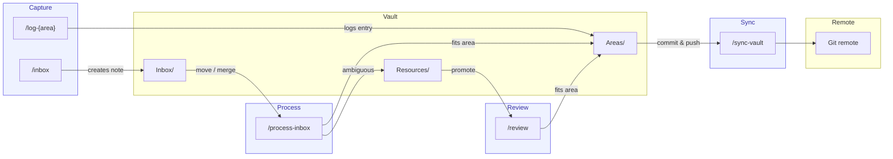

# Mneme

A personal knowledge vault powered by [Obsidian](https://obsidian.md) and
[Claude Code](https://claude.ai/code). Plain markdown files in a Git repository
— no proprietary formats, no sync fees, no lock-in.

## ✨ What you get

- **Structured Areas** — long-term topics organised in folders you define
- **Quick capture** — drop thoughts into `Inbox/`, route them later with
  `/process-inbox`
- **AI-assisted processing** — Claude proposes cross-links and enriches content
  during inbox triage; you review and approve
- **Smart staging** — `Resources/` holds notes without a clear home; three
  related resources trigger promotion to a new Area, stale ones get flagged for
  deletion
- **Area Journaling** — `/log-{area}` skills for areas with recurring entries,
  generated when you run `/setup`
- **Periodic reviews** — `/review` surfaces stale notes, broken links, and
  orphaned content
- **End-to-end encrypted** — `git-crypt` renders your markdown opaque in the
  remote; only key holders can read your content
- **Git-backed** — every change is versioned; commit with `/sync-vault`
- **Auto-formatting** — Prettier + markdownlint run on every commit via
  pre-commit hook

## 🔄 Workflow



## 🧠 Skills

| Skill            | Description                                               |
| ---------------- | --------------------------------------------------------- |
| `/setup`         | One-time bootstrapper — run this first                    |
| `/inbox`         | Capture a fleeting note                                   |
| `/process-inbox` | Route inbox notes to their Areas                          |
| `/review`        | Periodic vault health check                               |
| `/sync-vault`    | Commit and push all changes                               |
| `/log-{area}`    | Log an entry to a journalled area (generated by `/setup`) |

## 🔒 Privacy

Your vault content is private by default — only you have access to your Git
repository. For an extra layer of protection, you can encrypt all markdown files
at rest with [git-crypt](https://github.com/AGWA/git-crypt):

```sh
brew install git-crypt
git-crypt init
git-crypt add-gpg-user YOUR_GPG_KEY_ID
```

Then add this to `.gitattributes`:

```
**/*.md filter=git-crypt diff=git-crypt
```

Commit messages remain in plaintext — the `/sync-vault` skill reminds you to
keep them free of sensitive content.

## 🚀 Setup

### 📋 Prerequisites

- [Obsidian](https://obsidian.md) (free)
- [Claude Code](https://claude.ai/code)
- macOS with [Homebrew](https://brew.sh)

### 🛠️ Steps

1. Click **Use this template** → **Create a new repository**
2. Clone your new repo and enter the directory
3. Install dependencies and configure git hooks:

   ```sh
   make install && make setup
   ```

4. Open the vault in Obsidian (`File → Open Vault → select the repo folder`)
5. Open the repo in Claude Code and run:

   ```
   /setup
   ```

   Claude will ask which Areas you want to track and generate your personal
   vault structure and skills. This is a one-time step.
